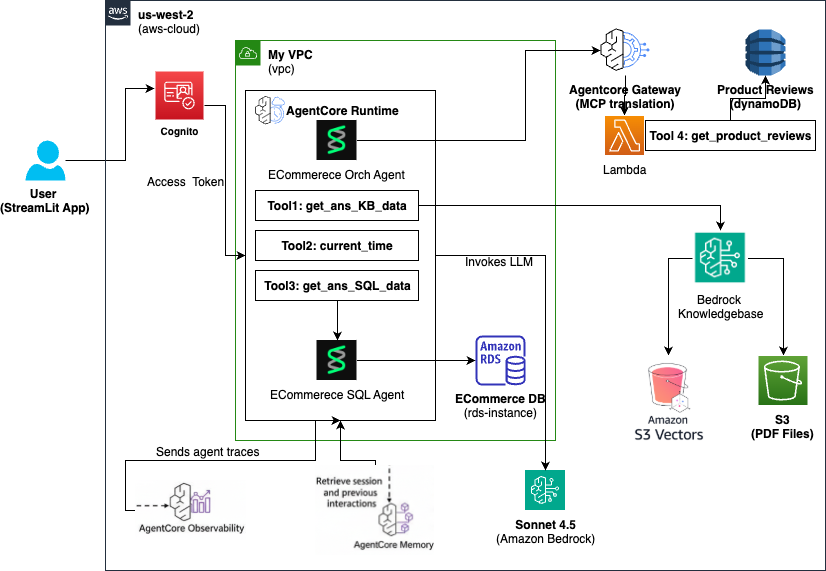

# ECommerce Agent - Capstone Project

An intelligent e-commerce assistant powered by AWS Bedrock AgentCore, featuring multi-agent orchestration, knowledge base integration, and SQL query capabilities.



## Overview

This project implements a sophisticated e-commerce agent that can:
- Answer product-related questions using structured (SQL) and unstructured (Knowledge Base) data
- Retrieve and analyze product reviews from DynamoDB
- Provide personalized responses based on customer authentication
- Maintain conversation context using AgentCore Memory
- Track interactions with AgentCore Observability

## Architecture

### Main Components

1. **ECommerce Orchestrator Agent** (`main.py`)
   - Deployed on AWS Bedrock AgentCore Runtime
   - Uses Claude 3.5 Sonnet LLM
   - Orchestrates multiple tools and sub-agents
   - Runs in VPC with RDS access

2. **Authentication**
   - AWS Cognito for user authentication
   - AgentCore Identity for JWT validation
   - Customer email extraction from JWT tokens

3. **Four Tools**
   - **Tool 1**: `get_product_reviews()` - Lambda function querying DynamoDB
   - **Tool 2**: `get_answers_for_structured_data()` - SQL Agent for RDS PostgreSQL
   - **Tool 3**: `get_answers_for_unstructured_data()` - Bedrock Knowledge Base with S3
   - **Tool 4**: `current_time()` - Built-in utility

4. **User Interface**
   - Streamlit web app with Cognito authentication
   - Local testing interface available

## Project Structure

```
.
├── main.py                          # Main orchestrator agent
├── main_ui_cognito.py              # Streamlit UI entry point
├── deploy_agent.sh                 # Deployment script
├── pyproject.toml                  # Python dependencies (uv)
├── requirements.txt                # Pip requirements
├── .bedrock_agentcore.yaml        # AgentCore configuration
├── .env                           # Environment variables
│
├── agent/                         # Sub-agents
│   ├── sql_agent.py              # SQL query agent for RDS
│   ├── kb_agent.py               # Knowledge Base agent
│   └── orch_agent_local.py       # Local testing orchestrator
│
├── ui/                           # User interfaces
│   ├── orch_web_app_cognito.py  # Cognito-authenticated UI
│   └── orch_web_app_local.py    # Local testing UI
│
├── lambda/                       # Lambda functions
│   ├── product_reviews_api.py   # Product reviews API
│   ├── product_reviews_api-schema.json
│   ├── deploy_lambda.sh         # Lambda deployment
│   └── README.md
│
├── prereqs/                      # Infrastructure setup
│   ├── setup_infrastructure.sh  # VPC, subnets, NAT gateway
│   ├── deploy_dynamo_db.sh     # DynamoDB table creation
│   ├── db_security_group_setup.sh
│   ├── agent_role.json         # IAM permissions
│   ├── database/
│   │   └── sample_data.sql     # RDS sample data
│   └── kb_files/               # Knowledge Base PDFs
│
└── generated-diagrams/          # Architecture diagrams
```

## Prerequisites

- Python 3.13+
- AWS Account with appropriate permissions
- AWS CLI configured
- `uv` package manager (recommended) or `pip`
- Docker (for container deployment)

## Setup

### 1. Install Dependencies

Using `uv` (recommended):
```bash
uv sync
```

Using `pip`:
```bash
pip install -r requirements.txt
```

### 2. Configure Secrets in AWS Secrets Manager

**Production (Recommended):** Store configuration in AWS Secrets Manager

```bash
# Create secret with all configuration
aws secretsmanager create-secret \
    --name capstone-ecommerce-agent-config \
    --description "Configuration for ECommerce Agent" \
    --secret-string '{
        "AWS_REGION": "us-west-2",
        "BEDROCK_MODEL_ID": "anthropic.claude-3-5-sonnet-20241022-v2:0",
        "BEDROCK_MODEL_ARN": "arn:aws:bedrock:us-west-2::foundation-model/anthropic.claude-3-5-sonnet-20241022-v2:0",
        "KB_ID": "your-knowledge-base-id",
        "DB_HOST": "your-rds-endpoint",
        "DB_PORT": "5432",
        "DB_NAME": "ecommerce",
        "DB_USER": "postgres",
        "DB_PASSWORD": "your-password",
        "AGENTCORE_MEMORY_ID": "your-memory-id",
        "GATEWAY_URL": "your-agentcore-gateway-url"
    }' \
    --region us-west-2
```

**Local Development (Optional):** Create a `.env` file for local testing

The agent automatically falls back to `.env` if Secrets Manager is unavailable:

```bash
AWS_REGION=us-west-2
BEDROCK_MODEL_ID=anthropic.claude-3-5-sonnet-20241022-v2:0
BEDROCK_MODEL_ARN=arn:aws:bedrock:us-west-2::foundation-model/anthropic.claude-3-5-sonnet-20241022-v2:0
KB_ID=your-knowledge-base-id
DB_HOST=your-rds-endpoint
DB_PORT=5432
DB_NAME=ecommerce
DB_USER=postgres
DB_PASSWORD=your-password
AGENTCORE_MEMORY_ID=your-memory-id
GATEWAY_URL=your-agentcore-gateway-url
```

**Update IAM Permissions:** Add Secrets Manager access to `prereqs/agent_role.json`:

```json
{
  "Sid": "SecretsManagerAccess",
  "Effect": "Allow",
  "Action": [
    "secretsmanager:GetSecretValue",
    "secretsmanager:DescribeSecret"
  ],
  "Resource": [
    "arn:aws:secretsmanager:us-west-2:*:secret:capstone-ecommerce-agent-config-*"
  ]
}
```

### 3. Deploy Infrastructure

```bash
# Create VPC, subnets, NAT gateway, security groups
cd prereqs
./setup_infrastructure.sh

# Deploy DynamoDB table with sample reviews
./deploy_dynamo_db.sh

# Setup RDS security group
./db_security_group_setup.sh
```

### 4. Deploy Lambda Function

```bash
cd lambda
./deploy_lambda.sh
```

### 5. Deploy Agent to AgentCore

```bash
# Configure agent
uv run agentcore configure \
  -e main.py \
  --vpc \
  --subnets subnet-xxx,subnet-yyy \
  --security-groups sg-xxx \
  --name capstone_ecommerce_agent \
  --region us-west-2 \
  --execution-role arn:aws:iam::xxx:role/YourRole \
  --disable-memory

# Deploy
uv run agentcore deploy

# Launch
uv run agentcore launch
```

## Usage

### Run Streamlit UI (with Cognito)

```bash
uv run streamlit run main_ui_cognito.py
```

### Run Locally (without Cognito)

```bash
uv run python main.py
```

### Test Lambda Function

```bash
cd lambda
python product_reviews_api.py
```

## Features

### Product Reviews API

Query product reviews with flexible filters:
```bash
# Get reviews for a product
curl 'https://lambda-url/?product_id=1'

# Filter by customer email
curl 'https://lambda-url/?customer_email=john.doe@email.com'

# Multiple filters with comma-separated values
curl 'https://lambda-url/?product_id=1,5,10&customer_id=1,2&top_rows=20'

# Date range filtering
curl 'https://lambda-url/?review_date_from=2024-01-01&review_date_to=2024-12-31'
```

### SQL Agent

Queries RDS PostgreSQL for:
- Order information
- Product details
- Customer data
- Shipment tracking

### Knowledge Base Agent

Searches product specifications from PDF documents stored in S3.

## Configuration Files

### `.bedrock_agentcore.yaml`

AgentCore configuration including:
- VPC settings
- Cognito JWT authentication
- Memory configuration
- Network mode

### `agent_role.json`

IAM permissions for:
- Bedrock model invocation
- DynamoDB access
- RDS connectivity
- S3 access
- AgentCore services
- **AWS Secrets Manager** (for configuration retrieval)

## Development

### Local Testing

```bash
# Test orchestrator locally
uv run python agent/orch_agent_local.py

# Test SQL agent
uv run python agent/sql_agent.py

# Test KB agent
uv run python agent/kb_agent.py
```

### Debugging

Enable verbose logging:
```python
logging.basicConfig(level=logging.DEBUG)
```

Check AgentCore logs:
```bash
uv run agentcore logs
```

## Deployment

### Update Agent

```bash
uv run agentcore deploy
```

### Destroy Agent

```bash
uv run agentcore destroy
```

## Database Schema

### DynamoDB - ProductReviews

- **Partition Key**: `product_id` (Number)
- **Sort Key**: `review_id` (String)
- **Attributes**: customer_id, customer_email, product_name, rating, title, comment, review_date, helpful_votes, verified_purchase

### RDS PostgreSQL

Tables: customers, products, orders, order_items, categories

See `prereqs/database/sample_data.sql` for schema and sample data.

## Configuration Management

### Secrets Manager (Production)

The agent uses AWS Secrets Manager for secure configuration management:

**Benefits:**
- ✅ Centralized secret management
- ✅ Automatic rotation support
- ✅ Audit trail via CloudTrail
- ✅ No secrets in code or environment variables
- ✅ IAM-based access control

**How it works:**
1. Agent attempts to load configuration from Secrets Manager on startup
2. If successful, logs: `Successfully loaded X configuration values from Secrets Manager`
3. If Secrets Manager is unavailable, falls back to `.env` file
4. Logs which configuration source was used

**Update secrets:**
```bash
# Update a single value
aws secretsmanager update-secret \
    --secret-id capstone-ecommerce-agent-config \
    --secret-string '{...updated JSON...}' \
    --region us-west-2

# No code redeployment needed - restart agent to pick up changes
uv run agentcore launch
```

**Cost:** ~$0.40/month per secret + $0.05 per 10,000 API calls

### Local Development

For local testing without AWS credentials:
1. Create `.env` file with configuration
2. Agent automatically falls back to `.env` when Secrets Manager is unavailable
3. Logs: `Using .env file for configuration`

## Troubleshooting

### Secrets Manager Access Denied

If you see "Error loading secrets from AWS Secrets Manager":
1. Verify IAM role has `secretsmanager:GetSecretValue` permission
2. Check secret name matches: `capstone-ecommerce-agent-config`
3. Verify region matches your deployment
4. Agent will fall back to `.env` file automatically

### MCP Client Errors

If you see "Unsupported protocol version":
```bash
uv pip install --upgrade strands-agents
```

### VPC Connectivity Issues

Ensure AgentCore is in the same VPC as RDS:
```yaml
network_configuration:
  network_mode: VPC
  network_mode_config:
    subnet_ids: [subnet-xxx, subnet-yyy]
    security_group_ids: [sg-xxx]
```

### Lambda Authentication

Lambda uses AWS_IAM authentication. Ensure AgentCore execution role has:
```json
{
  "Effect": "Allow",
  "Action": ["lambda:InvokeFunctionUrl"],
  "Resource": ["arn:aws:lambda:region:account:function:ProductReviewsAPI"]
}
```

### Configuration Not Loading

Check CloudWatch Logs for:
```
Successfully loaded 10 configuration values from Secrets Manager
```

If you see fallback message, verify:
1. Secret exists: `aws secretsmanager describe-secret --secret-id capstone-ecommerce-agent-config`
2. IAM permissions are attached to execution role
3. Region is correct in both secret and agent configuration

## Contributing

1. Create feature branch
2. Make changes
3. Test locally
4. Deploy to dev environment
5. Submit pull request

## License

[Your License Here]

## Contact
Sameer Battoo (battoo.sameer@live.com)
